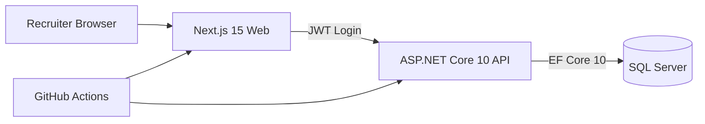

# FULLSTACK-01 Architecture Notes

## Initial direction
- Monorepo-style folder layout with isolated backend and frontend.
- Backend-first contract design with OpenAPI.
- Frontend consumes backend API using typed clients.

## Deployment intent
- Containerized local dev using compose.
- Cloud target selected: Vercel (web), Azure Container Apps (API), Azure SQL Database.

## Current architecture

## Visual assets
- architecture-overview.svg
- deployment-topology.svg